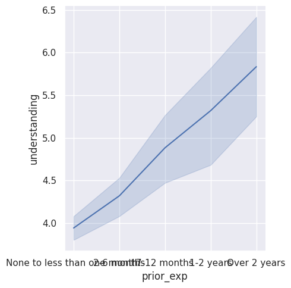
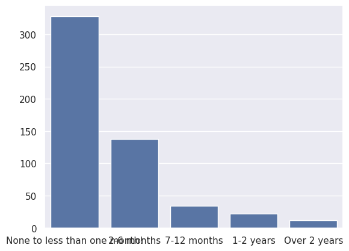

---
# Do not edit the text between these lines!
layout: default
---

# Project Survey: Student Understanding and Prior Experience

<!-- This is a comment. Below, you'll see code for inserting an image. To make this image appear, update <custom-path>. To add an image, save it inside the imgs folder of this repository. -->

##This graph shows a positive trendline, indicating correlation in understanding and prior experience.

##This graph shows that there is a slight correlation between understanding and prior experience with a slight positive trend.

##This graph shows that most students in the class have little to no prior coding knowledge.

Conclusion: This data shows that there is a correlation between understanding and prior experience. So the data supports our idea but not strongly. 
